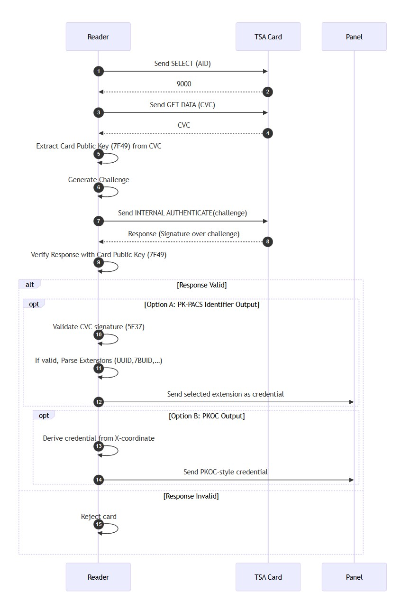

# Taglio Secure Authenticator Specification with CVC and PKOC

Version 1.0.5 January 6, 2026

## Copyright Notice

**Copyright 2025 Taglio LLC** Licensed under the Apache License, Version 2.0 (the "License"); you may not use this file except in compliance with the License. You may obtain a copy of the License at http://www.apache.org/licenses/LICENSE-2.0 Unless required by applicable law or agreed to in writing, software distributed under the License is distributed on an "AS IS" BASIS, WITHOUT WARRANTIES OR CONDITIONS OF ANY KIND, either express or implied. See the License for the specific language governing permissions and limitations under the License.

# 1. Overview

This document provides a specification of the application interface of the Taglio Secure Authenticator (TSA) Card to be implemented by a Reader.

TSA supports PK-PACS credentials through the use of a Card Verifiable Certificate (CVC). TSA also supports a PKOC identifier. 

The specification requires that the TSA card is provisioned and contains:

- A public/private key pair (EC P-256 or RSA), and  
- A valid CVC stored in data object `7F21`.

In addition, if returning a PK-PACS identifier, the specification requires one or more Trust Anchor public keys for verifying the CVC.

TSA implements ISO/IEC 7816-4 APDU commands as referenced in the Appendix.

# 2. Authentication Flow

The following provides a high-level overview of the authentication flow:
- Send **SELECT** Command to TSA
- Send **GET DATA** Command to TSA to retrieve **CVC** 
- Extract the **Card Public Key** from the **CVC**
- Send **INTERNAL AUTHENTICATE** Command to TSA to retrieve  **Response**
- Verify **Response** using **Card Public Key**
- Extract a **PK-PACS Identifier** or construct a **PKOC Identifier**
- Send **Identifier** to **Panel**

# 3. CVC Structure
	
The Reader MUST select the TSA application using the SELECT command. 

The Reader MUST use the GET DATA command to retrieve the Card Verifiable Certificate (CVC) from the Card. 

The TSA CVC is compliant with the PK-PACS CVC Specification [^CVCSPEC]. 

The following is an overview of the CVC structure:
	
| Tag          | Name                         | Description                          |
|--------------|------------------------------|--------------------------------------|
| **7F21**     | CV Certificate               | Top-level container                  |
| ├── **7F4E** | Certificate Body             | Contains all certificate data fields |
| │   ├── **5F29** | Profile Identifier           | Usually `00` for Profile v1          |
| │   ├── **42**   | Issuer Identification Number | 16-char Trust Root key reference     |
| │   ├── **7F49** | Public Key                   | RSA or EC key                        |
| │   ├── **5F20** | Subject Reference            | 16-char card identifier              |
| │   ├── **5F25** | Effective Date               | YYMMDD                               |
| │   ├── **5F24** | Expiration Date              | YYMMDD                               |
| │   └── **65**   | Certificate Extension Data   | **Optional**                             |
├── **5F37**     | Certificate Signature        | Signature over `7F4E`                |

The CVC is a BER TLV Structure.  All data objects except the Certificate Extension (tag 65) are mandatory. The order of the data objects is fixed.

# 4. Extracting the Card Public Key

The Card Public Key required to verify the TSA challenge-response signature is obtained from the 7F49 Public Key field inside the CVC Certificate Body (7F4E). 

The 06 Object Identifier inside 7F49 indicates the algorithm and parameter set used by the key:

| Tag          | Name                         | Description                          |
|--------------|------------------------------|--------------------------------------|
| **7F21**     | CV Certificate               | Top-level container                  |
| ├── **7F4E** | Certificate Body             | Contains all certificate data fields |
| │   ├── **7F49** | Public Key                   | RSA or EC key (EC-P256 in TSA)       |
| │   │   ├── **06** | OID                          | Algorithm/domain OID                 |

The following Key Types are supported:

| Key Type     | Algorithm / Parameters | OID                    | Encoding               |
| ------------ | ---------------------- | ---------------------- | -------------------------- |
| **EC P-256** | prime256v1 / secp256r1 | `1.2.840.10045.3.1.7`  | `06 08 2A8648CE3D030107`   |
| **RSA**      | rsaEncryption          | `1.2.840.113549.1.1.1` | `06 09 2A864886F70D010101` |

The Reader MUST Support the EC Public key.  The Reader MAY support the RSA public key.

The following sections specify the specific parameters for RSA and EC public keys.

## 4.1 RSA Public Key

The data objects in an RSA public key encoding are shown below. The order of the data objects is fixed.

| Tag | Data Object Name    | Abbrev. | Type              | Option |
|-----|----------------------|---------|-------------------|--------|
| **06** | Object Identifier    | —       | Object Identifier | m      |
| **81** | Composite Modulus     | n       | Unsigned Integer  | m      |
| **82** | Public Exponent       | e       | Unsigned Integer  | m      |

## 4.2 Elliptic Curve Public Key

The data objects contained in an EC public key are shown below. The order of the data objects is fixed.

Conditional domain parameters (tags 81–85) must be **either all present or all absent**, meaning an EC key sequence is encoded in one of two forms:

- **minimal form:** OID + Public Point (`06`, `86`)  
- **full parameter form:** OID + all curve parameters (`06`, `81`–`86`)

The reader MUST support the minimal form, and MAY support the full parameter form.

| Tag | Data Object Name     | Abbrev. | Type              | Option |
|-----|-----------------------|---------|-------------------|--------|
| **06** | Object Identifier     | —       | Object Identifier | m      |
| **81** | Prime Modulus         | p       | Unsigned Integer  | c      |
| **82** | First Coefficient     | a       | Unsigned Integer  | c      |
| **83** | Second Coefficient    | b       | Unsigned Integer  | c      |
| **84** | Base Point            | G       | EC Point          | c      |
| **85** | Order                 | n       | Unsigned Integer  | c      |
| **86** | Public Point          | Q       | EC Point          | m      |

# 5. Card Challenge Response

The reader MUST use a cryptographically strong random challenge (nonce). The reader MAY generate the challenge using a cryptographically secure random number generator. The Reader MAY retrieve the challenge from a Secure Access Module (SAM) or from the Panel.

The Reader MUST send the challenge to the card using the INTERNAL AUTHENTICATE command to verify that the Card Public Key is bound to the Private Key on the card. 

The reader MUST verify the INTERNAL AUTHENTICATE response signature using the Card Public Key extracted from the CVC field 7F49. The verification input is exactly the challenge bytes previously sent to the TSA — no hashing, padding, or transformation other than those implied by the signature algorithm itself (ECDSA or RSA).

For EC-P256 keys, the reader must parse the returned DER-encoded ECDSA signature (SEQUENCE { r, s }) and run an ECDSA-P256 verification operation over the original challenge and the public point Q = 04 || X || Y extracted from tag 86 inside 7F49.

If the signature does not verify against the Card Public Key from the CVC, the card MUST be rejected and no credential of any type must be output.

# 6. PK-PACS Identifier Output

If the reader outputs PK-PACS identifiers, the reader must validate the CVC signature using a Trust Anchor public key provisioned to the Reader. The Trust Anchor to be used is identified by one of the following CVC elements:

- The Issuer Identification Number (Tag 42)
- The KeyID OID from the CVC extension (OID 1.3.6.1.4.1.59685.7.1)

The Reader then verifies the CVC signature (5F37) over the DER-encoded Certificate Body (**7F4E**). If the CVC signature fails to verify, the Reader MUST NOT output any data.

Once the CVC signature has been verified, the reader may parse and output any PK-PACS Identifier extension included under tag 65. Each extension appears as a Discretionary Data Template (73) containing an Object Identifier (06) and its associated value (53). The reader selects one such validated extension as the legacy credential and passes it to the access panel. 

## Certificate Extension Data Structure
| Field                         | Tag                                         |
|--------------------------------------------|------|
| Certificate Extension Data                         | 65| 
| ├─ Discretionary Data Template                     | 73 | 
| │  ├─ PK-PACS OID| 06| 
| │  ├─ Value               | 53|

## PK-PACS Identifiers

The following PK-PACS identifiers specified in the PK-PACS Credential Specification [^PKPACS] MUST be supported.

| Name         | OID                    | DER Type       | Length (bytes) |
|---------------|------------------------|----------------|----------------|
| KeyID| 1.3.6.1.4.1.59685.7.1  | OCTET STRING   | 32|
| UUID          | 1.3.6.1.4.1.59685.8.1  | OCTET STRING   | 16             |
| 4ByteUID    | 1.3.6.1.4.1.59685.8.2  | OCTET STRING   | 4              |
| 7ByteUID    | 1.3.6.1.4.1.59685.8.3  | OCTET STRING   | 7              |
| 10ByteUID   | 1.3.6.1.4.1.59685.8.5  | OCTET STRING   | 10             |
| BinaryID     | 1.3.6.1.4.1.59685.8.7  | BIT STRING     | 25 (variable)        |

Other PK-PACS identifiers MAY be supported.

# 7. PKOC Identifier Output

After the challenge–response signature has been successfully verified with the Card Public Key extracted from the CVC, the reader may construct a PKOC identifier derived directly from that key. 

For EC Public Key: The Card Public Key contained in the CVC (7F49) includes the uncompressed EC point Q = 04 || X || Y. The reader MUST construct the PKOC identifier by taking the X-coordinate of this point.

For RSA Public Key: The Reader MUST construct the PKOC identifier by generating a SHA256 Hash of the RSA public key. 

After constructing the identifier, the Reader MAY format it according to the access-control system’s requirements. Typical formats include the full 32-byte value (256-bit identifier) or a truncated value such as the lower 128, 75 or 64-bit values for legacy systems. This identifier can be sent to the access panel without requiring validation of the CVC itself, because the authentication (proof-of-possession) is already provided by the successful signature check.

# 8. Normative References

For more information on PK-PACS: https://www.pk-pacs.org/

[^CVCSPEC] The PK-PACS CVC specification: https://github.com/TaglioLLC/pk-pacs-spec/blob/main/pkpacs-cvc-spec-DRAFT.md

[^PKPACS] The PK-PACS Credential specification: https://github.com/TaglioLLC/pk-pacs-spec/blob/main/pkpacs-credential-spec-DRAFT.md 

For more information on PKOC: https://psialliance.org/securecredentials/

# Appendix A: TSA Commands

## A1: SELECT Command

ISO 7816‑4 `SELECT by AID`command, returns the Application Version Number   

| Field | Value (hex)  | Description                           |
|-------|--------------|---------------------------------------|
| CLA   | `00`         | Interindustry class                   |
| INS   | `A4`         | SELECT                                |
| P1    | `04`         | Select by DF Name (AID)               |
| P2    | `00`         | First/only occurrence                 |
| Lc    | `0A`         | Length of AID                         |
| Data  | `F07461672E7473610101` | TSA AID                     |
| Le    | `00`         | Max length of expected response       |

**Response:**

| Tag  | Name                      | Example Value                | Description                                    |
|------|---------------------------|------------------------------|------------------------------------------------|
| 6F   | FCI Template              | …                            | File Control Information Wrapper               |
| 84   | DF Name (AID)             | `F07461672E7473610101`       | TSA application identifier                     |
| 64   | FMD (File Management Data)| …                            | Container for version / management information |
| 9F08 | Application Version Number| `01 07`                      | TSA app version (e.g. 0x0107 = v1.7)           |
| SW1/SW2 | Status                 | `9000`                        | Success (or ISO 7816 error code on failure)    |

Returns FCI and status `9000` on success.

---

## A2: GET DATA Command

ISO 7816‑4 `GET DATA` command reads the CVC (`7F21`) from TSA 

| Field | Value (hex) | Description                              |
|-------|-------------|------------------------------------------|
| CLA   | `00`        | Interindustry                            |
| INS   | `DA`        | GET DATA                                 |
| P1    | `7F`        | High tag byte (CVC)                      |
| P2    | `21`        | Low tag byte (CVC)                       |
| Lc    | –           | Absent                                   |
| Data  | –           | None                                     |
| Le    | `00` or extended | Request full CVC                    |

 
**Response:**

| Field       | Value      | Description                                  |
|-------------|------------|----------------------------------------------|
| CVC (`7F21`) | Var        | Complete CVC Data    |
| SW1/SW2     | `0x9000`   | Success status or other ISO 7816 status code       |

## A3: INTERNAL AUTHENTICATE Command

ISO 7816‑4 `INTERNAL AUTHENTICATE` command with Challenge, returns 

| Field | Value (hex) | Description                               |
|-------|-------------|-------------------------------------------|
| CLA   | `00`        | Interindustry                             |
| INS   | `88`        | INTERNAL AUTHENTICATE                     |
| P1    | `00`        | RFU                                       |
| P2    | `01` (ex.)  | Key ID (TSA auth key, typically `01`)     |
| Lc    | `nn`        | Length of challenge                       |
| Data  | Var         | Challenge bytes (transaction ID)          |
| Le    | `00`        | Request full signature                    |

**Response:**

Example with EC Signature

| Field       | Format / Example                                  | Description                                           |
|-------------|----------------------------------------------------|-------------------------------------------------------|
| Signature   | DER-encoded ECDSA `SEQUENCE { r, s }`    | Digital signature over the challenge (EC P-256)       |
|             | Example: `30 45 02 20 ... 02 21 ...`    |                                                       |
| SW1/SW2     | `0x9000`   | Success status or other ISO 7816 status code       |

## A4: ISO 7816 Status Codes

Overview of status codes 

| Code | Meaning (simplified)                      |
|------|-------------------------------------------|
| `9000` | Success                                 |
| `6700` | Wrong length                            |
| `6982` | Security conditions not satisfied       |
| `6985` | Conditions of use not satisfied         |
| `6A80` | Invalid data / template                 |
| `6A86` | Wrong parameters P1/P2                  |
| `6A88` | Referenced data/key not found           |

# Appendix B:  Authentication Flow Diagram

